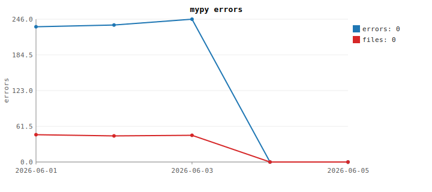
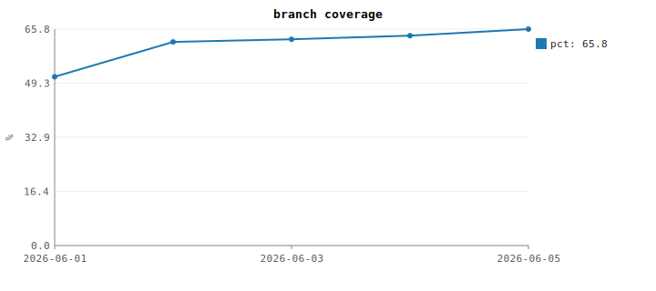
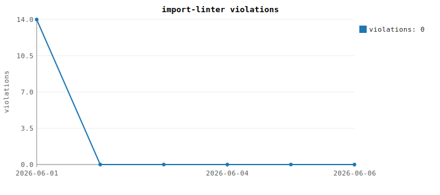
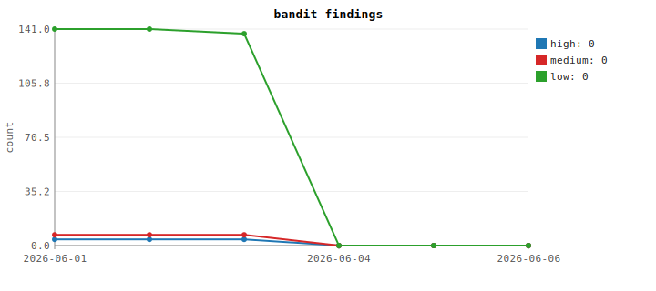
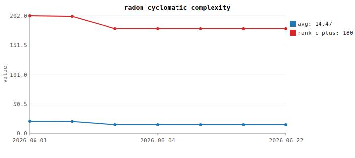
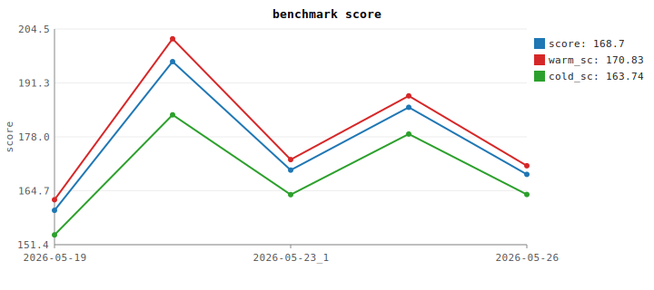

# QA

Code-quality policy for the main `homebase` package. All tools are
dev-dependencies in root `pyproject.toml` (`[dependency-groups] dev`).
Run via `uv run`.

This QA scope excludes `integrations/`. Integrations are optional
standalone projects with their own manifests, lockfiles, and local QA
commands.

This document is **authoritative**. Update the status table and the
history CSV/SVG after every QA run (see [Recording history](#recording-history)).
Baseline numbers must never regress — fix the code, don't bump the
number.

```
docs/QA/
├── README.md              ← this file
├── history/<tool>.csv     ← time series (one row per date)
├── graphs/<tool>.svg      ← rendered chart per tool (linked inline below)
└── scripts/qa_track.py    ← runs tool, parses metric, appends CSV, regen SVG
```

---

## Status snapshot

Last run: `2026-06-26` · source: 225 files / 53k LOC · tests: 187 files / ~38k LOC

| Tool          | Metric                          | Baseline     | Target        | Status   |
|---------------|---------------------------------|--------------|---------------|----------|
| pytest        | tests passing                   | 2308/2308    | all           | green    |
| ruff          | lint findings                   | 0            | 0             | green    |
| mypy          | errors / files affected         | 0 / 0        | 0 / 0         | green    |
| pytest-cov    | branch coverage                 | 66.4 %       | 75 %          | baseline |
| import-linter | contract violations             | 0            | 0             | green    |
| vulture       | findings (min-confidence 80)    | 0            | 0             | green    |
| vulture       | findings (min-confidence 60)    | ~291 lns     | review        | baseline |
| bandit        | High / Medium / Low             | 0 / 0 / 0    | 0 / 0 / < 20  | green    |
| radon (cc)    | avg complexity                  | C (14.48)    | B (≤ 10)      | baseline |
| radon (cc)    | functions ranked C or worse     | 180          | 0             | baseline |
| radon (mi)    | files at maintainability ≤ C    | 15           | 0             | baseline |
| benchmark     | latest score / warm / cold      | 168.7 / 170.8 / 163.7 | ↑ over time | tracked  |

Tracked-over-time tools (graphs below): `mypy`, `coverage`,
`import-linter`, `bandit`, `radon-cc`, `benchmark`.

---

## Tools

### 1. pytest — test suite

```
uv run pytest
```

- All tests must pass at every commit (AGENTS.md §9).
- Per-bug-fix: add or update regression test in the same change.
- No filesystem/sqlite mocking — use `tmp_path`.
- TUI / Textual screens are tested through Textual's `Pilot`
  harness with `pytest-asyncio` (`asyncio_mode = "auto"` in
  `pyproject.toml`). Reference:
  https://textual.textualize.io/guide/testing/.
- **Recommended pattern for modal screens** — minimal harness App
  pushes one screen and stashes the dismiss value:

  ```python
  class _Harness(App[None]):
      def __init__(self, factory):
          super().__init__()
          self._factory = factory
          self.result = "__unset__"
      def compose(self):
          yield Static("harness")
      async def on_mount(self):
          self.push_screen(self._factory(), lambda v: setattr(self, "result", v))

  async def test_modal() -> None:
      app = _Harness(lambda: ConfirmScreen("ok?"))
      async with app.run_test() as pilot:
          await pilot.press("y")
          await pilot.pause()
          assert app.result is True
  ```

  See `tests/test_ui_pilot_modals.py`, `test_ui_pilot_choices.py`,
  `test_ui_pilot_rename.py`, `test_ui_pilot_restore.py`.
- **BApp-level Pilot tests are not in the suite.** Booting the full
  app via `run_test()` schedules many `call_after_refresh`
  background callbacks (cache refresh, worktree-health scan, pane
  probe, settings-config boot) that can fire after a test's
  assertion phase but before `run_test()` finishes tearing the
  screen down; one of them queries `#projects` and surfaces a
  `NoMatches` as a flaky failure depending on collection order.
  Modal-level Pilot tests give the best coverage-per-test ratio
  without that risk.

### 2. ruff — lint + import order

```
uv run ruff check src/homebase/ tests/
```

- Must be clean at every commit (AGENTS.md §10).
- `[tool.ruff.lint.per-file-ignores]` must remain empty. Fix code, not
  config.

### 3. mypy — static typing

```
uv run mypy src/homebase
```

- Config in `pyproject.toml` `[tool.mypy]`: `check_untyped_defs`,
  `warn_unreachable`, `warn_unused_ignores`, `warn_redundant_casts`.
- No `# type: ignore` without an inline comment explaining why.



### 4. pytest-cov — branch coverage

```
uv run pytest --cov=homebase --cov-report=term
uv run pytest --cov=homebase --cov-report=html   # detailed
```

- Config in `pyproject.toml` `[tool.coverage.*]` (branch coverage on).
- Slow (~100 s). Run after meaningful changes, not on every save.



### 5. import-linter — layering enforcement

```
uv run lint-imports
```

- Contract in `pyproject.toml` `[tool.importlinter]` mirrors AGENTS.md
  §5 layering. Each iteration must remove at least one violation.



### 6. vulture — dead code

```
uv run vulture src/homebase                       # high-confidence only
uv run vulture src/homebase --min-confidence 60   # broader review
```

- Clean at default confidence (80). Lower-confidence findings are
  reviewed per iteration; suppress with `# noqa: vulture  # reason`
  only with a justification.
- Not tracked over time (binary at confidence 80; review-only at 60).

### 7. bandit — security linting

```
uv run bandit -c pyproject.toml -q -r src/homebase
```

- Suppress intentional findings with `# nosec BXXX  # reason`.



### 8. radon — complexity + maintainability

```
uv run radon cc src/homebase -a -s -n C   # cyclomatic complexity, C+
uv run radon mi src/homebase -s -n B      # maintainability index, ≤ B
```

- Refactor target per AGENTS.md §7 (~500-line module rule).
- `cc` is tracked over time; `mi` is a snapshot.



### 9. benchmark — runtime performance score

```
uv b benchmark run         # produces a new scored run
uv b benchmark results     # show full history
```

- Uses the existing `b benchmark` machinery. `qa_track.py benchmark`
  does **not** run the suite — it reads the canonical YAML at
  `<base>/.homebase/benchmark.yaml` and projects three series into the
  QA history: `score` (composite), `warm_sc`, `cold_sc`.
- `score` is a weighted composite:
  `BENCHMARK_SCORE_WARM_WEIGHT * warm + BENCHMARK_SCORE_COLD_WEIGHT * cold`
  (currently 0.7 / 0.3, see `core/constants.py`). Computed in
  `workspace/benchmark_report.composite_score`; `score_runs` recomputes
  it on read so older runs in `benchmark.yaml` display the new
  composite as long as `warm_elapsed_s` and `cold_elapsed_s` exist.
- Multiple runs on the same day are kept and labelled `YYYY-MM-DD_1`,
  `YYYY-MM-DD_2`, …; single-run days have no suffix.
- The CSV is rebuilt from the YAML on every invocation (YAML is the
  source of truth) — safe to re-run any time.



---

## Recording history

After running a tool, append the metric to the CSV and regenerate the
SVG with the tracking script:

```
uv run python docs/QA/scripts/qa_track.py                    # run all 5 tracked tools
uv run python docs/QA/scripts/qa_track.py mypy bandit        # subset
uv run python docs/QA/scripts/qa_track.py --charts-only      # only regen SVG from CSV
```

- Pure stdlib — no extra dependencies.
- One row per ISO date in `history/<tool>.csv`; re-running on the same
  day replaces that day's row.
- SVG is regenerated automatically after each append. To regenerate
  charts without re-running tools, use `--charts-only`.
- Multi-metric tools (bandit: high/medium/low, mypy: errors/files,
  radon-cc: avg/rank_c_plus, benchmark: score/warm_sc/cold_sc) produce
  one chart with multiple series.
- Same-day handling differs by tool:
  - **QA tools** (mypy, coverage, import-linter, bandit, radon-cc) —
    one row per ISO date; same-day re-runs replace that day's row.
  - **benchmark** — every run is kept (suffix `_1, _2, _3 …` when
    multiple share a date); CSV is rebuilt from
    `<base>/.homebase/benchmark.yaml` on each invocation.
- The CSVs are committed alongside the SVGs so trends survive across
  machines and sessions.

To track a new tool: add a `parse_<name>` function and an entry to
`TOOLS` in `scripts/qa_track.py`, then run it once to bootstrap the
CSV. Reference the new SVG inline in the relevant tool section above.

---

## Workflow

1. Run the tool(s) you intend to improve.
2. `uv run python docs/QA/scripts/qa_track.py [tool …]` — appends
   today's row, regenerates SVG.
3. Update the **Status snapshot** table with the new numbers.
4. Pick the next tool from **Iteration plan** below.
5. Commit only when ruff + pytest pass and the targeted-tool numbers
   improved or held.

### Single command for the full run

```
uv run pytest && \
uv run ruff check src/homebase/ tests/ && \
uv run mypy src/homebase && \
uv run pytest --cov=homebase --cov-report=term -q && \
uv run lint-imports && \
uv run vulture src/homebase && \
uv run bandit -c pyproject.toml -q -r src/homebase && \
uv run radon cc src/homebase -a -s -n C && \
uv run python docs/QA/scripts/qa_track.py
```

`qa_track.py` with no args runs the 5 QA tools and also rebuilds the
benchmark CSV/SVG from the existing YAML — no new benchmark run is
triggered (use `uv b benchmark run` for that).

---

## Iteration plan

Tackled one tool at a time. Each entry: goal, expected scope, exit
criterion. Tick `[x]` when the snapshot number reaches the target.

### Phase 1 — layering (import-linter)

- [x] Eliminate inward-layer violations from `cache`, `metadata`,
      `config`, `workspace.seed` etc. (14 → 0).
- Exit: `uv run lint-imports` reports `0 broken`.

### Phase 2 — complexity hotspots (radon cc)

- [x] Split or simplify the rank-F / rank-E functions first:
      `filter.engine.compile_filter_expr` (E40 → B7),
      `filter.tag_index.sync_tag_symlinks_detailed` (E37 → B6),
      `commands.basic.cmd_ls` (F45 → C11).
- [x] Bring all remaining rank-D+ entries to ≤ C (56 → 0).
- [ ] Drive the average of rank-C-or-worse blocks from C (14.4) down to B.
- Exit: avg ≤ B, no rank D+ functions.

### Phase 3 — typing (mypy)

- [x] Fix the 233 errors module-by-module. Start with `cli/`,
      `commands/`, `core/`, then domain modules, then `ui/`.
- [ ] Add return-type annotations to all public functions in `core/`,
      `config/`, `metadata/`, `cache/`, `workspace/`.
- Exit: `uv run mypy` reports `Success`.

### Phase 4 — security (bandit)

- [x] Triage the 4 High findings (3× SHA1 hashing for non-security
      contexts → `usedforsecurity=False`; 1× `subprocess shell=True` for
      user-defined post commands → `# nosec B602` with reason).
- [x] Drop Medium to 0 (tarfile extract uses validated members +
      `filter="data"`; SQL identifiers validated; download scheme
      restricted to http/https; regression test paths moved off `/tmp`).
- [x] Project-level skip for B404 / B603 / B607 (subprocess noise in
      CLI tools that intentionally shell out), B105 (parser operator
      constants), B101 (asserts as fail-fast invariants per
      AGENTS.md §8). Configured in `pyproject.toml`; QA invocation
      uses `bandit -c pyproject.toml`.
- Exit: 0 High, 0 Medium, 0 Low.

### Phase 5 — coverage (pytest-cov)

- [ ] Raise branch coverage 65.8 % → 75 %. Modal screens are now in
      the 83–95 % range via Pilot; the remaining gap is mostly
      `ui/app.py` mixins (which need a fully booted BApp without
      the flaky background work) plus `ui/actions/*` and
      `ui/side/*`.
- Pilot pattern (Textual): see the "pytest" tool section above for
  the recommended modal-harness pattern. Boot-the-full-BApp tests
  via `run_test()` were tried but were too flaky to keep in the
  suite — write Pilot tests at the screen / harness-app level.
- Recent lifts (cumulative across sessions):
  `ui/screens/choices.py` 16 → 89 %,
  `ui/screens/rename.py` 82 → 95 %,
  `ui/screens/restore.py` 58 → 90 %,
  `ui/screens/basic.py` 15 → 93 %,
  `ui/screens/actions.py` 15 → 83 %,
  `ui/actions/hotbar.py` (extracted from `ui/app.py`) → 98 %,
  `ui/app.py` 36 → 42 %,
  `workspace/benchmark.py` 36 → 62 %,
  `tmux/commands.py` 50 → 69 %,
  `workspace/projects.py` 77 → 86 %,
  `core/prompting.py` 56 → 93 %.
- Exit: ≥ 75 % branch coverage.

### Phase 6 — dead code (vulture)

- [ ] Review the ~289 confidence-60 findings; delete confirmed unused
      code; suppress false positives with a one-line justification.
- Exit: confidence-60 output reviewed and resolved.

### Phase 7 — maintainability (radon mi)

- [ ] No file ranked below B. Likely overlaps with Phase 2 refactors.
- Exit: `uv run radon mi src/homebase -s -n B` is empty.

---

## Adding or removing a QA tool

- Add to `[dependency-groups] dev` in `pyproject.toml`.
- Add a `[tool.<tool>]` config block in `pyproject.toml`.
- Add a `### N. <tool>` section above with the `uv run` invocation.
- For tracked-over-time tools: add a `parse_<name>` + `TOOLS` entry in
  `scripts/qa_track.py`, run once to bootstrap, embed the SVG inline.
- Add a row to the **Status snapshot** table.
- Add a phase to the **Iteration plan** if a fix-up campaign is needed.
- Update AGENTS.md §10 if the tool is mandatory for commits.
