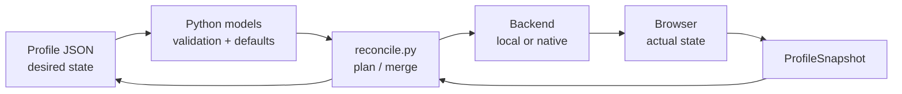
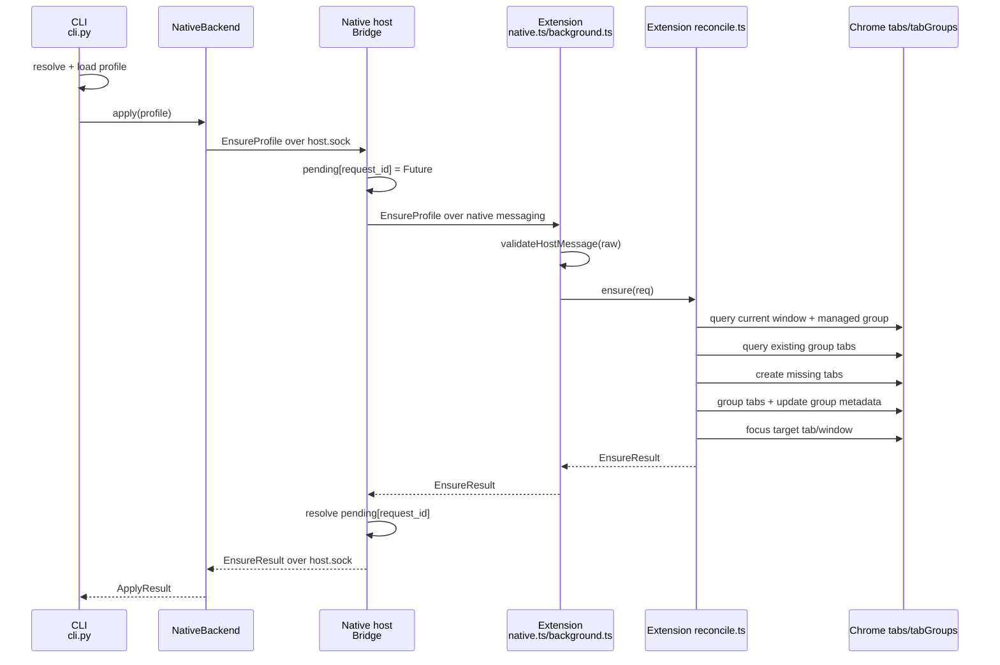
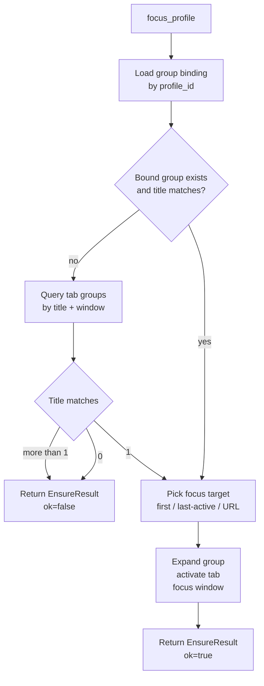
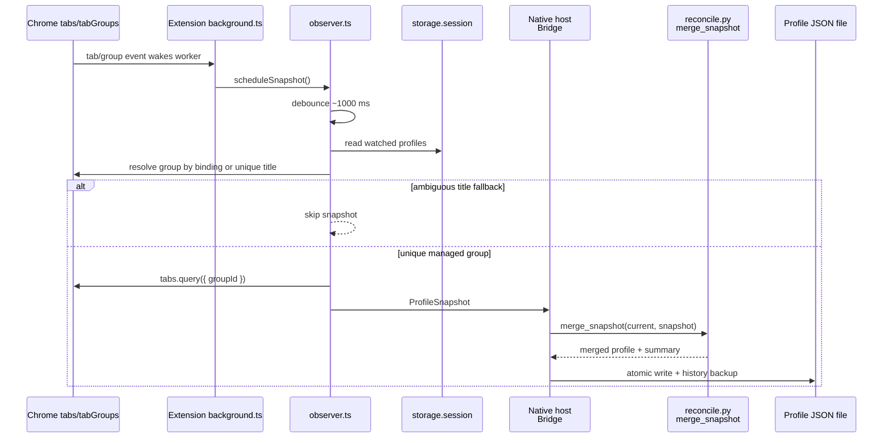
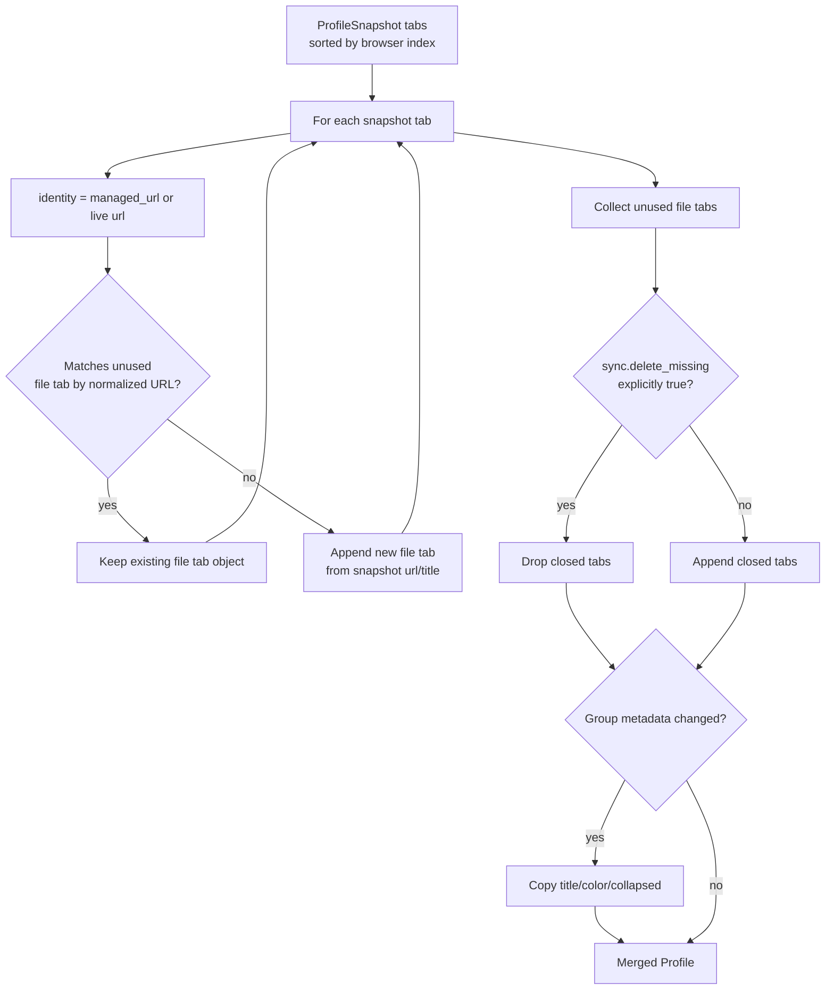
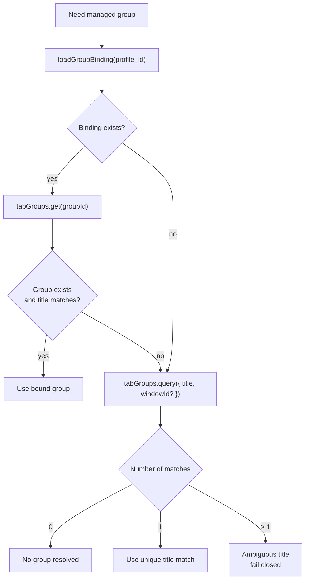
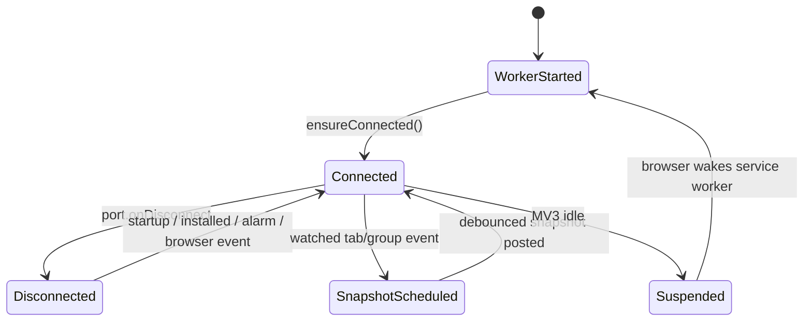
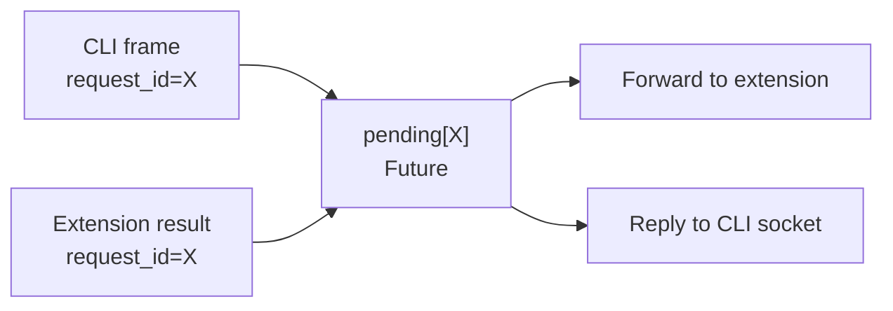

# Architecture

`homebase-bts` reconciles a JSON profile file into a real browser tab group.

The file is desired state. The browser is actual state. The Python CLI/native
host owns validation, policy, merge, and file IO. The extension owns only
browser API IO.

```text
profile JSON -> Python models -> reconcile plan -> backend -> browser
browser events -> extension snapshot -> native host -> merge -> profile JSON
```



## Repository Layout

```text
schema/      JSON Schemas for profile files and native messaging
cli/         Python CLI, native host, models, merge/reconcile logic
extension/   MV3 extension, native port, browser mutation, snapshots
examples/    Example profile files
```

Important files:

| File | Role |
|---|---|
| `schema/profile.schema.json` | Profile file contract. |
| `schema/native-messaging.schema.json` | Native messaging protocol contract. |
| `cli/src/homebase_bts/models.py` | Pydantic mirror of the profile schema. |
| `cli/src/homebase_bts/protocol.py` | Pydantic mirror of the native protocol. |
| `cli/src/homebase_bts/reconcile.py` | Pure diff/merge/policy logic. |
| `cli/src/homebase_bts/nativehost.py` | Browser-owned host process and socket bridge. |
| `cli/src/homebase_bts/backends/native.py` | CLI client for the host socket. |
| `extension/src/protocol.ts` | TypeScript mirror plus runtime validation for host messages. |
| `extension/src/reconcile.ts` | Browser mutations: ensure/focus managed group. |
| `extension/src/observer.ts` | Browser event observer and debounced snapshots. |
| `extension/src/binding.ts` | Session-local tab/group bindings. |
| `extension/entrypoints/background.ts` | MV3 service worker wiring. |

## Profile Model

Minimal profile:

```json
{
  "schema": 1,
  "id": "vacation",
  "tabs": [
    { "url": "https://maps.google.com/" },
    { "url": "https://www.google.com/travel/flights" }
  ]
}
```

Expanded profile:

```json
{
  "schema": 1,
  "id": "vacation",
  "title": "Vacation",
  "browser": {
    "preferred": "chrome",
    "strategy": "tab-group",
    "window": "current"
  },
  "group": {
    "title": "Vacation",
    "color": "cyan",
    "collapsed": false,
    "focus": "first"
  },
  "tabs": [
    { "url": "https://maps.google.com/", "title": "Maps" },
    { "url": "https://www.google.com/travel/flights", "title": "Flights" }
  ],
  "sync": {
    "mode": "two-way",
    "delete_missing": false,
    "adopt_existing": true,
    "match": "normalized-url"
  }
}
```

Defaults are applied in `cli/src/homebase_bts/models.py`:

| Field | Default |
|---|---|
| `browser.preferred` | `chrome` |
| `browser.strategy` | `tab-group` |
| `browser.window` | `current` |
| `group.color` | `grey` |
| `group.collapsed` | `false` |
| `group.focus` | `first` |
| `sync.mode` | `two-way` |
| `sync.delete_missing` | `false` |
| `sync.adopt_existing` | `true` |
| `sync.match` | `normalized-url` |

Profile validation rejects:

- unknown top-level/profile fields;
- invalid profile IDs;
- non-HTTP(S) tab URLs;
- invalid enum values.

## Native Protocol

Native messaging uses Chrome's length-prefixed JSON framing:

```text
uint32 little-endian length
UTF-8 JSON body
```

The JSON bodies are protocol messages. The schema is
`schema/native-messaging.schema.json`.

Host to extension:

```json
{
  "type": "ensure_profile",
  "request_id": "3198db0f-67ef-4a38-b57b-449b9834a812",
  "profile": {
    "schema": 1,
    "id": "vacation",
    "tabs": [{ "url": "https://maps.google.com/" }]
  }
}
```

Extension to host:

```json
{
  "type": "ensure_result",
  "request_id": "3198db0f-67ef-4a38-b57b-449b9834a812",
  "ok": true,
  "created_tabs": 1,
  "existing_tabs": 0,
  "group_created": true
}
```

Extension snapshot:

```json
{
  "type": "profile_snapshot",
  "profile_id": "vacation",
  "browser": "chrome",
  "group_id": 42,
  "group": { "title": "Vacation", "color": "cyan", "collapsed": false },
  "tabs": [
    {
      "browser_tab_id": 1001,
      "url": "https://maps.google.com/",
      "managed_url": "https://maps.google.com/",
      "title": "Maps",
      "active": true,
      "index": 0
    }
  ]
}
```

Validation happens twice on the host-to-extension path:

```text
Python host:
  protocol.py -> TypeAdapter(Message).validate_json(...)

Extension:
  native.ts -> validateHostMessage(raw) -> background dispatch
```

The Python side also caps incoming frame bodies at `8 MiB`.

## Process Topology

There are three runtime actors.

```text
homebase-bts CLI
  connects to
native host Unix socket
  forwards to/from
Chrome native messaging stdio
  connected to
MV3 extension service worker
  calls
Chrome tabs/tabGroups APIs
```



```mermaid
flowchart LR
    cli["homebase-bts CLI<br/>short-lived process"]
    sock["Unix socket<br/>host.sock"]
    host["Python native host<br/>browser-owned process"]
    stdio["Native messaging<br/>stdio frames"]
    sw["MV3 service worker<br/>extension"]
    chrome["Chrome APIs<br/>tabs / tabGroups"]

    cli <-->|length-prefixed JSON| sock
    sock <-->|asyncio Unix server| host
    host <-->|uint32 + JSON| stdio
    stdio <-->|connectNative| sw
    sw <-->|browser.* APIs| chrome
```

The native host is not a daemon started by the user. Chrome starts it when the
extension calls `browser.runtime.connectNative("nu.boa.homebase_bts")`.

The host also opens a local Unix socket so short-lived CLI commands can reach
the already-connected extension:

```text
HBTS_RUNTIME_DIR/homebase-bts/host.sock
$XDG_RUNTIME_DIR/homebase-bts/host.sock
<per-user temp>/homebase-bts-<uid>/host.sock
```

Persistent state:

```text
~/.config/homebase-bts/sim-browser.json   local backend state
~/.config/homebase-bts/sync.json          persistent two-way sync targets
~/.config/homebase-bts/logs/              native host logs
```

Runtime state:

```text
host.sock                                    CLI <-> host IPC
extension storage.session                    tab/group bindings and watched profiles
```

## Apply Flow

Command:

```bash
homebase-bts apply examples/vacation.json
```

Flow:

```text
cli.py
  profileio.resolve(...)
  profileio.load(...)
  NativeBackend.apply(...)
    send EnsureProfile over host.sock
nativehost.py
  read CLI frame
  create pending future by request_id
  write frame to extension over stdout
extension/native.ts
  receive native message
  validateHostMessage(...)
  dispatch to background handler
extension/reconcile.ts
  ensure(...)
  resolve managed group
  reuse matching tabs
  create missing tabs
  group new tabs
  update group title/color/collapsed
  focus selected tab
  return EnsureResult
nativehost.py
  route EnsureResult by request_id
cli.py
  render ApplyResult
```



Example `ensure_profile` action:

```json
{
  "type": "ensure_profile",
  "request_id": "7a9fe57e-d2b1-449d-9ac0-cf86fe90196a",
  "profile": {
    "schema": 1,
    "id": "docs",
    "group": { "title": "Docs", "color": "blue" },
    "tabs": [
      { "url": "https://docs.python.org/3/" },
      { "url": "https://developer.chrome.com/docs/extensions/" }
    ]
  }
}
```

Result after first apply:

```json
{
  "type": "ensure_result",
  "request_id": "7a9fe57e-d2b1-449d-9ac0-cf86fe90196a",
  "ok": true,
  "created_tabs": 2,
  "existing_tabs": 0,
  "group_created": true,
  "focused": true
}
```

Result after second apply:

```json
{
  "type": "ensure_result",
  "request_id": "7a9fe57e-d2b1-449d-9ac0-cf86fe90196a",
  "ok": true,
  "created_tabs": 0,
  "existing_tabs": 2,
  "group_created": false,
  "focused": true
}
```

Idempotency comes from URL matching plus session bindings:

- current tab URL can match desired URL;
- recorded `tab_id -> desired URL` can match desired URL after redirects;
- each actual tab can be claimed once.

## Focus Flow

Command:

```bash
homebase-bts focus examples/vacation.json
```

The CLI sends:

```json
{
  "type": "focus_profile",
  "request_id": "8dc5ff0d-f2c8-4f4d-9610-74606d31f9f1",
  "profile_id": "vacation",
  "group_title": "Vacation",
  "focus": "first"
}
```

The extension:

1. Resolves the managed group.
2. Expands the group if collapsed.
3. Picks a tab:
   - `first`;
   - `last-active`;
   - matching focus URL.
4. Activates the tab.
5. Focuses the window.

If group title fallback is ambiguous, focus returns an error instead of choosing
an arbitrary group.



## Two-Way Sync Flow

Two-way sync is enabled by `apply` when `sync.mode` is `two-way`.

Registration message:

```json
{
  "type": "watch_profile",
  "request_id": "80d62a27-4571-49d3-b920-503bb38dcf4d",
  "profile_id": "vacation",
  "group_title": "Vacation",
  "file_path": "/Users/me/work/vacation.json",
  "debug": false
}
```

Host-side registration:

```text
nativehost.py
  _validate_sync_target(...)
    resolve file_path
    require existing file
    parse profile
    require profile.id == message.profile_id
  save sync target to sync.json
  send StartWatch to extension
```

Extension watch state:

```json
{
  "bm:watched": {
    "vacation": {
      "title": "Vacation",
      "groupId": 42
    }
  }
}
```

The watch state lives in `storage.session`, because it is only valid for the
current browser session. The host persists the durable file target in `sync.json`
and re-arms watches when the host restarts.

Snapshot flow:

```text
browser tabs/tabGroups event
  background top-level listener wakes MV3 worker
  observer.scheduleSnapshot()
  debounce ~1000 ms
  observer.snapshotAll()
  resolve watched group by binding or unique title
  browser.tabs.query({ groupId })
  post ProfileSnapshot to host
  host merge_snapshot(...)
  profileio.write_atomic(...)
```



The extension listens to:

- `tabs.onCreated`
- `tabs.onRemoved`
- `tabs.onMoved`
- `tabs.onAttached`
- `tabs.onDetached`
- `tabs.onUpdated`
- `tabGroups.onUpdated`
- `tabGroups.onMoved`
- `tabGroups.onRemoved`

## Merge Rules

`cli/src/homebase_bts/reconcile.py` has two separate operations:

- `plan(profile, snapshot)`: desired file -> browser actions.
- `merge_snapshot(profile, snapshot)`: browser snapshot -> updated file.

Snapshot merge algorithm:

```text
for each snapshot tab in browser order:
  identity = managed_url or live url
  if identity matches an unused file tab by normalized URL:
    keep the existing file tab object
  else:
    append a new file tab from snapshot url/title

closed = file tabs not used above
if profile.sync.delete_missing:
  drop closed tabs
else:
  append closed tabs to the end

if group metadata changed:
  copy title/color/collapsed into profile.group
```



Example: redirect does not rewrite the file.

File:

```json
{
  "schema": 1,
  "id": "maps",
  "tabs": [{ "url": "https://maps.google.com/" }]
}
```

Snapshot:

```json
{
  "type": "profile_snapshot",
  "profile_id": "maps",
  "browser": "chrome",
  "tabs": [
    {
      "browser_tab_id": 1,
      "url": "https://www.google.com/maps/@59,10,12z",
      "managed_url": "https://maps.google.com/",
      "index": 0
    }
  ]
}
```

Merged file keeps:

```json
{ "url": "https://maps.google.com/" }
```

Example: closed tab with default non-destructive policy.

File:

```json
{
  "schema": 1,
  "id": "x",
  "tabs": [
    { "url": "https://a.example/" },
    { "url": "https://b.example/" }
  ]
}
```

Snapshot only contains `a.example`. With default `delete_missing: false`, the
merged file still contains both tabs. With `delete_missing: true`, `b.example`
is removed.

## Group Identity

Chrome `tab_id`, `group_id`, and `window_id` are session-local. They are useful
hints, not stable identity.

Current extension resolution order:

1. Load session binding by `profile_id`.
2. If the bound group still exists and its title matches, use it.
3. Otherwise query by title.
4. If exactly one title match exists, use it.
5. If multiple title matches exist, fail closed.

Fail-closed behavior:

- snapshots are skipped;
- focus returns an error;
- apply creates a new managed group instead of mutating an arbitrary group.

This is intentionally conservative. Title fallback is a recovery path after MV3
worker restarts or browser session changes, not the primary identity mechanism.



## URL Matching

Matching policies:

| Policy | Behavior |
|---|---|
| `exact-url` | Desired URL must equal actual URL. |
| `normalized-url` | Lowercase scheme/host, strip known tracking params, drop most fragments, drop trailing slash. |
| `title-url` | Reuse by matching title first, then fall back to normalized URL. |

Normalization strips:

```text
utm_source, utm_medium, utm_campaign, utm_term, utm_content,
fbclid, gclid, mc_eid, mc_cid, igshid
```

Fragments are dropped except for configured hosts such as `github.com`.

Example:

```text
https://Example.com/docs/?utm_source=x#top
https://example.com/docs
```

These match under `normalized-url`.

## Extension Lifecycle

The extension is MV3, so the background service worker can be suspended.

The design accounts for that:

- top-level event listeners are registered in `background.ts`;
- watch state is stored in `storage.session`;
- `alarms` periodically calls `ensureConnected()`;
- native port reconnection is idempotent;
- the host re-sends `start_watch` messages from persisted `sync.json`.

The native port is a singleton in `extension/src/native.ts`. If it disconnects,
the extension clears the port and reconnects on the next startup, install event,
alarm, or observed browser event.



## Native Host Internals

`Bridge` in `cli/src/homebase_bts/nativehost.py` owns three maps:

```python
pending: dict[str, asyncio.Future[Message]]
sync_targets: dict[str, tuple[Path, str]]
debug_subscribers: dict[str, list[asyncio.StreamWriter]]
```

`pending` routes one CLI request to one extension reply:

```text
CLI request with request_id X
  pending[X] = future
  send to extension
extension result with request_id X
  future.set_result(result)
  write result to CLI socket
```



`sync_targets` stores persistent file sync registrations:

```json
{
  "vacation": {
    "file_path": "/Users/me/work/vacation.json",
    "group_title": "Vacation"
  }
}
```

`debug_subscribers` are read-only CLI sockets that receive raw snapshots. They
do not cause file writes.

## Local Backend

The local backend is a file-backed browser simulator used by tests and offline
development. It persists state in:

```text
~/.config/homebase-bts/sim-browser.json
```

Example state:

```json
{
  "vacation": {
    "group_id": 1,
    "next_tab_id": 4,
    "tabs": [
      { "browser_tab_id": 2, "url": "https://maps.google.com/", "active": false, "index": 0 },
      { "browser_tab_id": 3, "url": "https://www.google.com/travel/flights", "active": false, "index": 1 }
    ]
  }
}
```

It exercises the same `plan(...)` logic as the native backend, without Chrome or
native messaging.

## File Writes

Profile writes use `profileio.write_atomic(...)`:

```text
if history enabled:
  copy current file to .homebase-bts/history/
write new JSON to temp file in same directory
fsync temp file
rename temp file over target
fsync parent directory
```

This prevents partial profile files on process crash or write failure.

## Development Flow

Setup:

```bash
mise run setup
```

Run extension with dev browser and native host manifest:

```bash
mise run ext:dev
```

Apply to real browser:

```bash
mise run cli:run -- apply examples/vacation.json
```

Apply to simulator:

```bash
mise run cli:run -- apply examples/vacation.json --local
```

Checks:

```bash
mise run test
mise run lint
homebase-bts doctor
```

## Current Limitations

- The local backend is a simulator, not a browser automation backend.
- Durable SQLite state exists as a schema module but is not yet wired into the
  native apply/sync path.
- `extension/src/protocol.ts` mirrors schemas manually; schema changes must be
  mirrored in Python and TypeScript in the same change.
